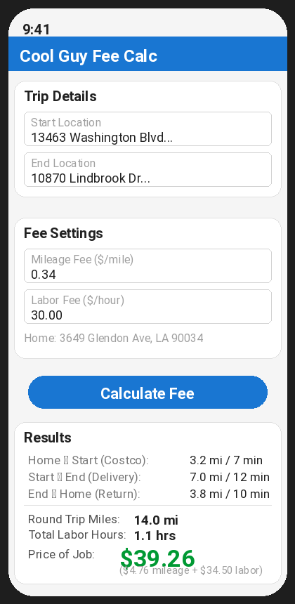

# Cool Guy Transport and Delivery Fee Calculator

## Table of Contents

- [Purpose](#purpose)
- [User Interface](#user-interface)
- [Cost Determination Formulas](#cost-determination-formulas)
  - [Estimate](#estimate)
  - [Actual (STOP at delivery destination)](#actual-stop-at-delivery-destination)
- [Wiring the application to Google Matrix API](#wiring-the-application-to-google-matrix-api)
  - [Get an API key](#get-an-api-key)
  - [Add the key to the app](#add-the-key-to-the-app)
  - [Secure the key (optional but recommended)](#secure-the-key-optional-but-recommended)
  - [Billing](#billing)

## Purpose

The purpose of the Cool Guy Transport and Delivery Fee Calculator is to determine the fee for a given Transport and Delivery event. A Transport and Delivery event is one in which a client pay Cool Guy Transport and Delivery to move an item from one location to another. The fee is calculated on a door to door basis. For example, if a client want to have a newly purchased 85" TV delivered from the Costco at 13463 Washington Blvd, Marina Del Rey, CA 90292 to 10870 Lindbrook Drive 10870 Lindbrook Dr, Los Angeles, CA 90024 the fee is calculated according to the following rules:

HOME_LOCATION = 3649 Glendon Ave, LA CA, 90034
DEFAULT_MILEAGE_FEE = .34 per mile
DEFAULT_LABOR_FEE - 30.00 per hour

Once the delivery start and end locations are determined, the fee is calculated as the sum of the following:

* Distance from HOME_LOCATION to 13463 Washington Blvd, Marina Del Rey, CA 90292 x DEFAULT_MILEAGE_FEE
* Estimated load in time of 20 minutes x DEFAULT_LABOR_FEE
* Distance from 13463 Washington Blvd, Marina Del Rey, CA 90292 to 10870 Lindbrook Dr, Los Angeles, CA 90024 x DEFAULT_MILEAGE_FEE
* Distance from 10870 Lindbrook Drive 10870 Lindbrook Dr, Los Angeles, CA 90024 to HOME_LOCATION x DEFAULT_MILEAGE_FEE
* Estimated time to get to 13463 Washington Blvd, Marina Del Rey, CA 90292 from HOME_LOCATION (according to Google Maps) x DEFAULT_LABOR_FEE
* Estimated time to get to 10870 Lindbrook Dr, Los Angeles, CA 90024 from 13463 Washington Blvd, Marina Del Rey, CA 9029 (according to Google Maps) x DEFAULT_LABOR_FEE
* Estimated load out time of 20 minutes x DEFAULT_LABOR_FEE
* Estimated time to get to HOME_LOCATION from 10870 Lindbrook Dr, Los Angeles, CA 90024 (according to Google Maps) x DEFAULT_LABOR_FEE

## User Interface



| Parameter      | Value                              | UI ELEMENT                                                |
|----------------|------------------------------------|-----------------------------------------------------------|
| Start Location | {START_LOCATION_ADDRESS}           | TEXT or LOCATION PICKER with Validation for valid address |
| Start Location | {END_LOCATION_ADDRESS }            | TEXT or LOCATION PICKER with Validation for valid address |
| Milage Fee     | {DEFAULT TO  DEFAULT_MILEAGE_FEE } | TEXT with Validation for decimal value                    |
| Labor Fee      | DEFAULT TO  DEFAULT_LABOR_FEE      | TEXT with Validation for decimal value                    |
|                | **(ESTIMATE_BUTTON)**              |  |
|                | {ESTIMATE WITH DETAILS HERE}       | |
|                | **(START/STOP_BUTTON)**            |  |
| Price of Job:  | {CALCULATED_PRICE_OF_JOB}          |  |
|                | **(RESET_BUTTON)**                 |  |


Estimated Round Trip in Miles: {MILEAGE FROM HOME TO START TO END TO HOME}
Estimated Time : {(TIME FROM HOME TO START TO END TO HOME) + (LOAD_IN_TIME) + (LOAD_OUT_TIME)}

Price of Job: {CALCULATED_PRICE_OF_JOB}

(ESTIMATE_BUTTON) : Shows the estimated price of the job when clicked

{ESTIMATE WITH DETAILS HERE} : Estimated Mileage and Labor cost

(START/STOP_BUTTON) : Starts a timer that keeps track of the actual time it took to execute the job. Once the job starts,
the button displays STOP. When the STOP button is clicked the {CALCULATED_PRICE_OF_JOB} is displayed. The application anticipates that
a user will click the stop button at the end of the delivery to the destination location so that the customer can pay at the time of 
load out. However, the calculator will use the Google API to determine the time and mileage from the destination location to the home location
and add that cost to the actual cost. In other words, the customer will pay for the following:

{CALCULATED_PRICE_OF_JOB} : Displays Actual miles, actual time, actual calculated price of cost of job. 

(RESET_BUTTON) : Resets the UI, clearing all values in anticipation of accepting another job.

## Cost Determination Formulas

### Estimate

* Mileage fee = (home→start + start→end + end→home) × mileage rate
* Labor fee = (total drive time + 20min load-in + 20min load-out) × labor rate
* Total = mileage fee + labor fee

### Actual (STOP at delivery destination)

* Job labor fee = elapsed timer hours × labor rate
* Return trip data fetched from Google API (delivery address → home)
* Return mileage fee = return distance × mileage rate
* Return labor fee = return drive time × labor rate
* Mileage fee = (home→start + start→end + actual return distance) × mileage rate
* Total = mileage fee + job labor fee + return labor fee

## Wiring the application to Google Matrix API

Location lookup is executed using the Google Maps Distance Matrix API to calcuate distance and travel time.

### Get an API key

* Go to https://console.cloud.google.com
* Create a project (or select existing)
* Go to APIs & Services > Library
* Search for "Distance Matrix API" and enable it
* Go to Credentials > Create Credentials > API Key
* Copy the key

### Add the key to the app

Create a `secrets.properties` file in the project root with your API key:

```properties
MAPS_API_KEY=AIzaSyYourActualKeyHere
```

The `.gitignore` already excludes this file so it stays local and never gets committed. The build script (`app/build.gradle.kts`) automatically reads the key from this file and makes it available as `BuildConfig.MAPS_API_KEY` at compile time.

### Secure the key (optional but recommended)
   In the Google Cloud Console, under API Keys > Edit > Application restrictions, choose Android apps and add your app's package name (com.coolguy.feeCalc) and SHA-1 signing certificate fingerprint.

### Billing
   The Distance Matrix API requires a billing account. Google offers a $200/month free credit which covers ~40,000 calls/month.

